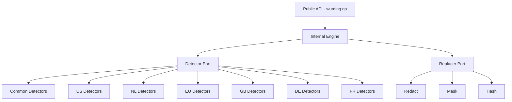

# Hexagonal Design

wuming is built on a hexagonal architecture that separates domain logic from concrete implementations through well-defined port interfaces.

## Architecture Diagram

## Layers

### Domain Layer (`domain/`)

The domain layer defines the core types and interfaces that the rest of the system depends on. It has zero external dependencies.

- **`model.PIIType`** -- Enumeration of all PII categories (Email, Phone, CreditCard, IBAN, NationalID, TaxID, etc.)
- **`model.Match`** -- Represents a single PII detection: type, value, position, confidence, locale, and detector name.
- **`model.Severity`** -- Classification of how sensitive a PII type is (Low, Medium, High, Critical).
- **`port.Detector`** -- Interface that all detectors implement: `Detect(ctx, text)`, `Name()`, `Locales()`, `PIITypes()`.
- **`port.Replacer`** -- Interface that all replacers implement: `Replace(text, matches)`, `Name()`.

### Internal Layer (`internal/engine/`)

The engine is the orchestrator. It is internal to the module and not part of the public API. It:

- Selects detectors based on locale configuration
- Runs detectors concurrently with a semaphore for concurrency control
- Merges results and resolves overlapping matches (preferring higher confidence)
- Applies confidence and PII type filters
- Delegates replacement to the configured replacer

### Adapter Layer (`adapter/`)

Adapters are the concrete implementations of the port interfaces.

**Detectors** are organized by locale:

| Package | Locale | Detectors |
|---------|--------|-----------|
| `common` | Global (all locales) | Email, Credit Card, IBAN, IP Address, URL, MAC Address |
| `us` | United States | SSN, EIN, ITIN, Phone, Passport, ZIP Code, Medicare |
| `nl` | Netherlands | BSN, Phone, Postal Code, KvK, ID Documents |
| `eu` | European Union | VAT Number, Passport MRZ |
| `gb` | United Kingdom | NIN, NHS Number, UTR, Phone, Postcode |
| `de` | Germany | Steuer-ID, ID Card, Sozialversicherung, Phone, PLZ |
| `fr` | France | NIR, NIF, ID Card, Phone, Postal Code |

**Replacers** provide different substitution strategies:

| Replacer | Behavior |
|----------|----------|
| Redact | Replaces with `[TYPE]` placeholder |
| Mask | Masks characters with `*`, preserving last N |
| Hash | Deterministic SHA-256 hash (truncated) |
| Custom | User-defined replacement function |

## Why Hexagonal?

### Testability

Each detector is independently testable. The engine can be tested with mock detectors and replacers. No integration test needs real PII data.

### Extensibility

Adding a new locale means creating a new package under `adapter/detector/` and implementing the `Detector` interface. No existing code needs to change.

### Locale Isolation

Each locale's detection logic is fully contained in its own package. Dutch BSN validation (11-proof) lives in `adapter/detector/nl/`, completely independent from US SSN validation. This prevents accidental cross-locale interference and makes regulatory compliance easier to verify.

### Pluggable Strategies

The replacer port allows callers to choose or implement any substitution strategy without modifying the detection pipeline. The same set of matches can be redacted, masked, hashed, or transformed by custom logic.
