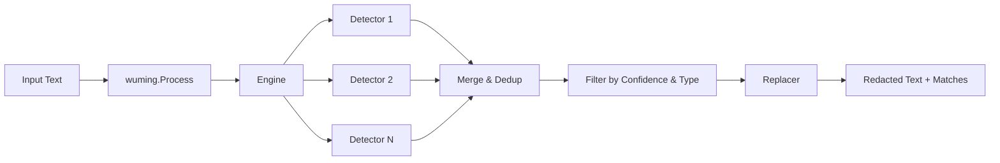

# Architecture Overview

wuming follows a **hexagonal architecture** (also known as ports and adapters) to keep the core domain logic independent of specific PII detection implementations. This enables easy extension, testing, and locale isolation.

## High-Level Data Flow



## Package Structure

```
wuming/
  wuming.go                 # Public API (New, Process, Detect, Redact)
  domain/
    model/pii.go            # Core types: PIIType, Match, Severity
    port/detector.go        # Detector interface
    port/replacer.go        # Replacer interface
    port/pipeline.go        # Result type
  internal/
    engine/engine.go        # Orchestrator: runs detectors, merges, deduplicates
  adapter/
    detector/
      common/               # Global patterns (email, credit card, IBAN, IP, URL, MAC)
      us/                   # US-specific (SSN, EIN, ITIN, phone, passport, ZIP, Medicare)
      nl/                   # Netherlands (BSN, phone, postal, KvK, ID documents)
      eu/                   # EU-wide (VAT, passport MRZ)
      gb/                   # UK (NIN, NHS, UTR, phone, postcode)
      de/                   # Germany (Steuer-ID, ID card, Sozialversicherung, phone, PLZ)
      fr/                   # France (NIR, NIF, ID card, phone, postal code)
    replacer/
      redact.go             # [TYPE] placeholders
      mask.go               # Character masking with preserved suffix
      hash.go               # Deterministic SHA-256 hashing
      custom.go             # User-defined replacement function
```

## Processing Pipeline

1. **Configuration** -- The caller creates a `Wuming` instance with options (locale, replacer, thresholds, concurrency).
2. **Detector selection** -- The engine filters detectors based on configured locales. Global detectors (those returning no locales) always run.
3. **Concurrent detection** -- Selected detectors run in parallel, bounded by the concurrency setting.
4. **Merge and dedup** -- All matches are collected, sorted by position, and overlapping matches are resolved by preferring higher confidence.
5. **Filtering** -- Matches below the confidence threshold or outside the requested PII types are removed.
6. **Replacement** -- The replacer substitutes matched text spans in reverse order (to preserve byte offsets) and returns the redacted text alongside all match metadata.
